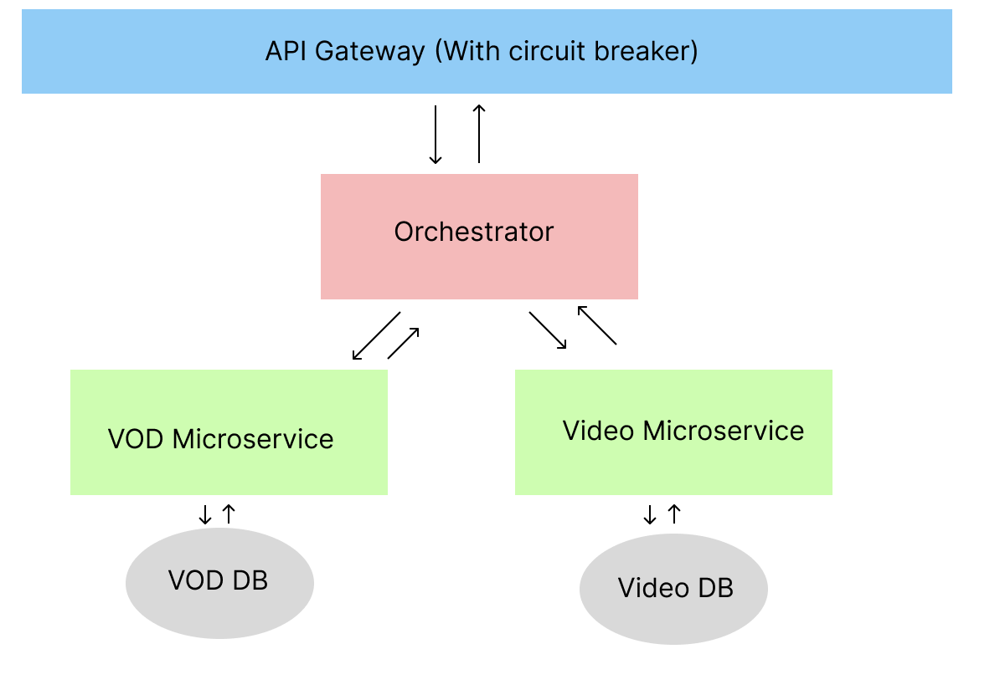

## Architecture Diagram

## Overview

This project is a SpringBoot-based microservice application designed to handle video-on-demand (VOD) services. The architecture includes an API Gateway, an Orchestrator, and two distinct microservices: VOD and VIDEO. The system works as follows:

- **API Gateway:** Acts as the single entry point for all client requests. It forwards incoming requests to the Orchestrator.
- **Orchestrator:** Manages the workflow by coordinating calls to the VOD and VIDEO microservices.
- **VOD Microservice:** Handles operations related to video-on-demand functionality.
- **VIDEO Microservice:** Manages video data and related operations.
